# Actividad 3

### Parte 1: Gestión de Usuarios
1. Creación de Usuarios: Crea tres usuarios llamados `usuario1`, `usuario2` y `usuario3`.
>sudo adduser usuario1
>sudo adduser usuario2
>sudo adduser usuario3
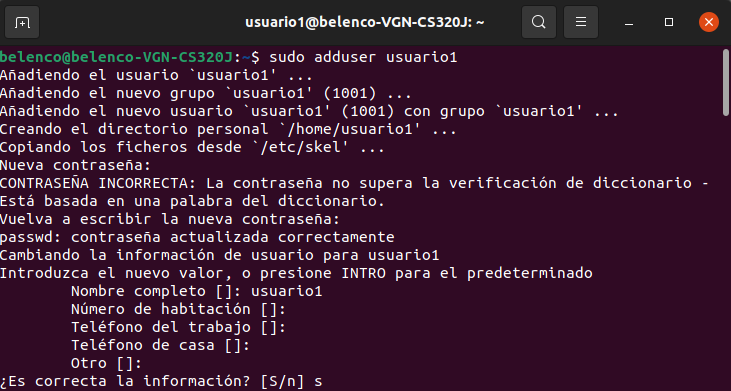

2. Asignación de Contraseñas: Establece una nueva contraseñas para cada usuario creado.
>sudo passwd usuario1
sudo passwd usuario2
sudo passwd usuario3
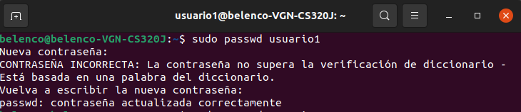

3. Información de Usuarios: Muestra la información de `usuario1` usando el comando `id`.
>id usuario1
id usuario2
id usuario3
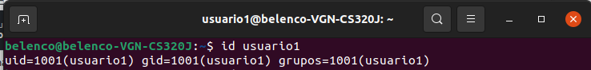

4. Eliminación de Usuarios: Elimina `usuario3`, pero conserva su directorio principal.
>sudo userdel -r usuario3
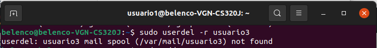

### Parte 2: Gestión de Grupos

1. Creación de Grupos: Crea dos grupos llamados `grupo1` y `grupo2`.
>sudo addgroup grupo1
sudo addgroup grupo2
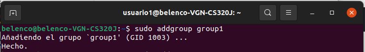

2. Agregar Usuarios a Grupos: Agrega `usuario1` a `grupo1` y `usuario2` a `grupo2`.
>sudo adduser usuario1 grupo1
sudo adduser usuario2 grupo2
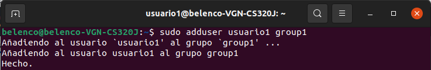

3. Verificar Membresía: Verifica que los usuarios han sido agregados a los grupos utilizando el comando `groups`.
>groups usuario1
groups usuario2
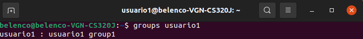

4. Eliminar Grupo: Elimina `grupo2`.
>sudo delgroup grupo2
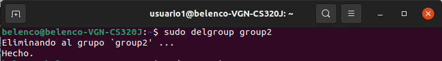

### Parte 3: Gestión de Permisos

1. Creación de Archivos y Directorios:
	- Como `usuario1`, crea un archivo llamado `archivo1.txt` en su directorio principal y escribe algo en él.
>sudo su - usuario1 
echo "Contenido en el archivo1 escrito por usuario1" > archivo1.txt

	- Crea un directorio llamado `directorio1` y dentro de ese directorio, un archivo llamado `archivo2.txt`.
>mkdir directorio1
echo "Contenido en el archivo1 escrito por usuario1" > directorio1/archivo2.txt

2. Verificar Permisos: Verifica los permisos del archivo y directorio usando el comando `ls -l` y `ls -ld` respectivamente.
>ls -l ~/archivo1.txt
ls -ld ~/directorio1
ls -ld ~/directorio1/archivo2.txt
ls -ltrh
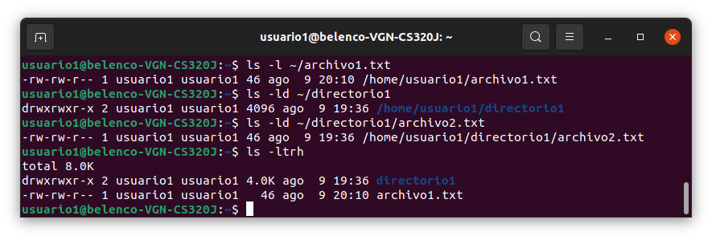

3. Modificar Permisos usando `chmod` con Modo Numérico: Cambia los permisos del `archivo1.txt` para que sólo `usuario1` pueda leer y escribir (permisos `rw-`), el grupo pueda leer (permisos `r--`) y nadie más pueda hacer nada.
>chmod 640 ~/archivo1.txt

4. Modificar Permisos usando `chmod` con Modo Simbólico: Agrega permiso de ejecución al propietario del `archivo2.txt`.
>chmod u+x ~/directorio1/archivo2.txt

5. Cambiar el Grupo Propietario: Cambia el grupo propietario de `archivo2.txt` a `grupo1`.
>sudo chown :grupo1 ~/directorio1/archivo2.txt

6. Configurar Permisos de Directorio: Cambia los permisos del `directorio1` para que sólo el propietario pueda entrar (permisos `rwx`), el grupo pueda listar contenidos pero no entrar (permisos `r--`), y otros no puedan hacer nada.
>chmod 750 ~/directorio1

7. Comprobación de Acceso: Intenta acceder al `archivo1.txt` y `directorio1/archivo2.txt` como `usuario2`. Nota cómo el permiso de directorio afecta el acceso a los archivos dentro de él.
>su usuario2
cat /home/usuario1/archivo1.txt
cat /home/usuario1/directorio1/archivo2.txt
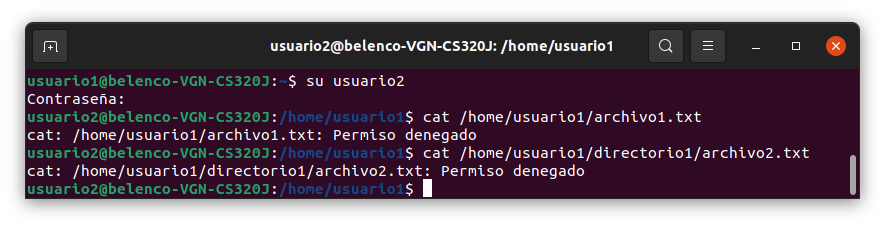

8. Verificación Final: Verifica los permisos y propietario de los archivos y directorio nuevamente con `ls -l` y `ls -ld`.
>ls -l ~usuario1/archivo1.txt
ls -ld ~usuario1/directorio1
ls -l ~usuario1/directorio1/archivo2.txt
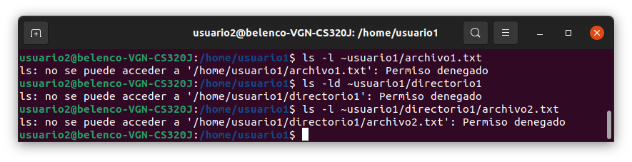

## Reflexión

### ¿Por qué es importante gestionar correctamente los usuarios y permisos en un sistema operativo?

Gestionar correctamente los usuarios y permisos es crucial para mantener la seguridad y privacidad de los datos en un sistema operativo. Esto permite controlar quién puede acceder, modificar y ejecutar archivos y recursos, previniendo accesos no autorizados y asegurando la integridad de la información.

### ¿Qué otros comandos o técnicas conocen para gestionar permisos en Linux?

Otros comandos y técnicas para gestionar permisos en Linux incluyen:
- `chown`: Cambia el propietario de un archivo o directorio.
- `umask`: Configura los permisos predeterminados para nuevos archivos y directorios.
- `sudo`: Ejecuta comandos con privilegios de superusuario.
- `su`: Cambia al usuario superusuario.
